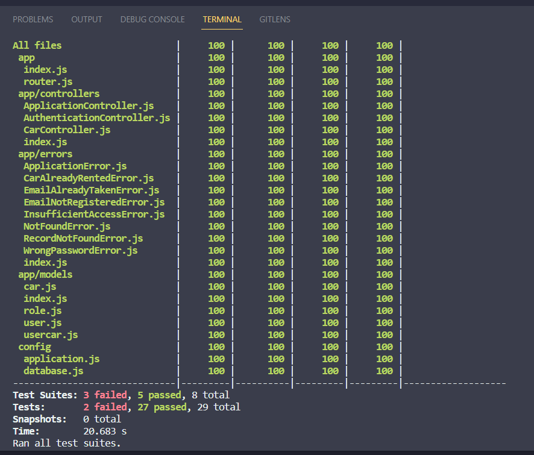
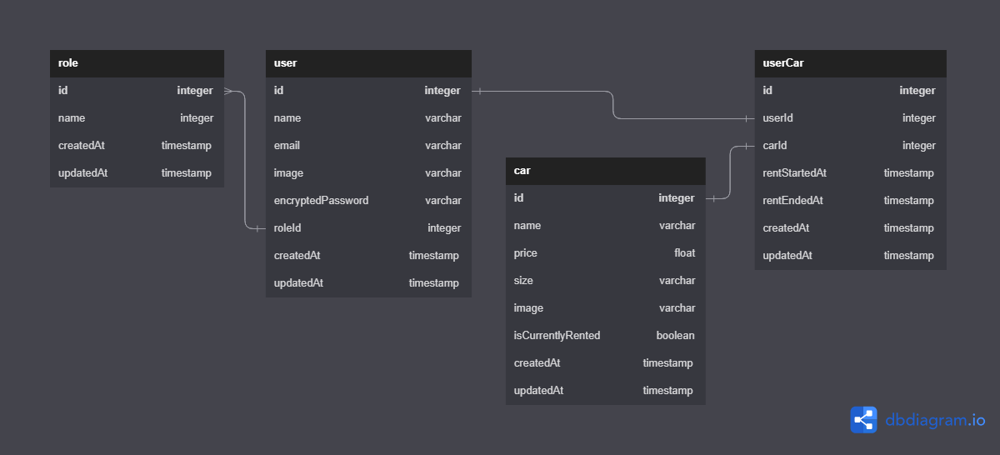

# Challenge Chapter 7
percobaan unit testing menggunakan jest dan supertest, dan percobaan deployment menggunakan railway

## Test Result


## Data Admin

-   email : rinaldo@binar.co.id
-   password : "15052001"

## Setup

1. Install Library

```bash
yarn install
```

2. Create an .env file on root folder

```bash
JWT_SIGNATURE_KEY=Rahasia
DB_USER=
DB_PASSWORD=
DB_NAME=
DB_HOST=
DB_PORT=
```

3. Create Database

```bash
yarn db:create
```

4. Migrating the model

```bash
yarn db:migrate
```

5. Using seeder

```bash
yarn db:seed
```

## How To Test

-   Testing the app
    -   it will execute pre-script command to run on test mode

```bash
yarn test
```

## How To Run

-   Running Project on development

```bash
yarn develop
```

## ERD
